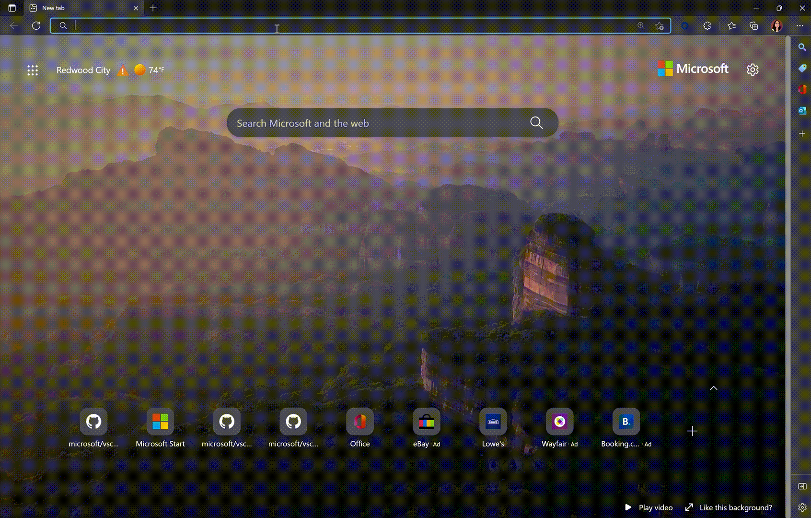
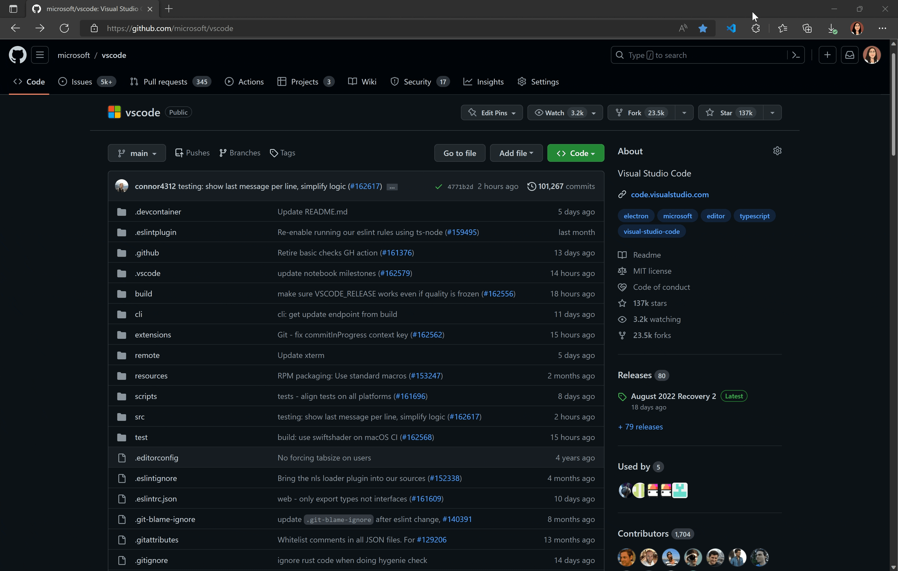

# Launch insiders.vscode.dev

A simple Chrome/Edge extension for opening GitHub repositories in https://insiders.vscode.dev.

## Features

Type `code` into your browser's search bar to activate the omnibox and launch your recent GitHub repositories in https://insiders.vscode.dev.



Or launch https://insiders.vscode.dev from any GitHub repo or PR page by
1. Typing `Ctrl+.` (default) or `Cmd+.` (Mac)
2. Clicking on the extension icon



## Acknowledgments

This extension's omnibox functionality is heavily inspired by Pine Wu's [goto-github-repo extension](https://github.com/octref/goto-github-repo) with many thanks.

## Development

To install this extension for development,
1. Clone this repository to your local machine with
```sh
git clone https://github.com/joyceerhl/launch-vscode-dev.git
```
2. In your Chrome browser, navigate to [chrome://extensions](chrome://extensions). In Edge, navigate to [edge://extensions](edge://extensions).
3. Click 'Load unpacked' and select the folder you cloned this repo into to install the extension.